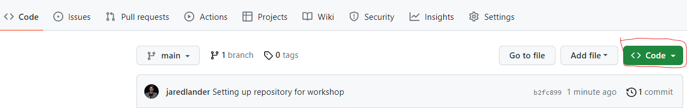
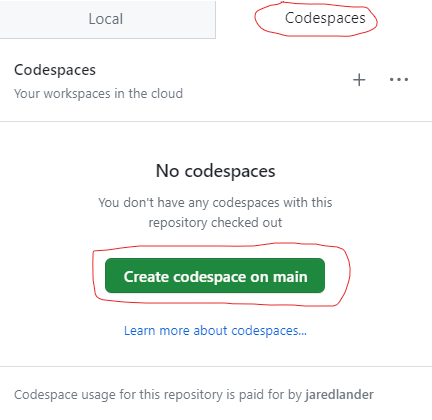

- [Introduction to Programming in R](#introduction-to-programming-in-r)
  - [Setup](#setup)
  - [Git](#git)
  - [Docker](#docker)
  - [Codespaces](#codespaces)
  - [RStudio Cloud](#rstudio-cloud)
  - [Class Plan](#class-plan)
  - [Instructor Bio](#instructor-bio)

<!-- README.md is generated from README.Rmd. Please edit that file -->

# Introduction to Programming in R

<!-- badges: start -->

<!-- badges: end -->

Thanks for attending my sessions at [Columbia Business School](%60r%20params$organizer_url%60). This repo will hold code we write in \[Introduction to Programming in R\](%60r%20params\$workshop_url%60) workshop.

## Setup

For this course you need a recent version of R. Anything greater than 4.0 is good but 4.3 is even better. I also highly recommend using your IDE/code editor of choice. Most people use either [RStudio](https://www.rstudio.com/products/rstudio/) or [VS Code](https://code.visualstudio.com/) with [R Language Extensions](https://code.visualstudio.com/docs/languages/r).

After you have R and your favorite editor installed, you should install the packages needed today with the following line of code.

<pre class='chroma'>
<span><span class='nf'><a href='https://rdrr.io/r/utils/install.packages.html'>install.packages</a></span><span class='o'>(</span><span class='nf'><a href='https://rdrr.io/r/base/c.html'>c</a></span><span class='o'>(</span></span>
<span>  <span class='s'>'here'</span>, <span class='s'>'markdown'</span>, <span class='s'>'rmarkdown'</span>, <span class='s'>'knitr'</span>, <span class='s'>'tidyverse'</span>, <span class='s'>'ggthemes'</span>, <span class='s'>'ggridges'</span>, </span>
<span>  <span class='s'>'tidymodels'</span>, <span class='s'>'coefplot'</span>, <span class='s'>'glmnet'</span>, <span class='s'>'xgboost'</span>, <span class='s'>'vip'</span>, <span class='s'>'DiagrammeR'</span>, <span class='s'>'here'</span>, </span>
<span>  <span class='s'>'DBI'</span>, <span class='s'>'themis'</span>, <span class='s'>'vetiver'</span>, <span class='s'>'fable'</span>, <span class='s'>'tsibble'</span>, <span class='s'>'echarts4r'</span>, <span class='s'>'leaflet'</span>, </span>
<span>  <span class='s'>'leafgl'</span>, <span class='s'>'leafem'</span>, <span class='s'>'tictoc'</span></span>
<span><span class='o'>)</span><span class='o'>)</span></span></pre>

## Git

If you are comfortable with git, you can clone this repo and have the project structure.

``` sh
git clone https://github.com/jaredlander/cbs2023fall.git
```

This includes the [renv](https://rstudio.github.io/renv/) lock file, so you can install all the packages with the following R code.

<pre class='chroma'>
<span><span class='nf'>renv</span><span class='nf'>::</span><span class='nf'><a href='https://rstudio.github.io/renv/reference/restore.html'>restore</a></span><span class='o'>(</span><span class='o'>)</span></span></pre>

## Docker

If you are having trouble installing R or the packages, but are comfortable with Docker, you can pull the Docker image using the following command in your terminal.

``` sh
docker pull jaredlander/cbs2023fall:4.3.0
```

You can run the container with the following command which will also mount a folder as a volume for you to use.

``` sh
docker run -it --rm --name rstudio_ml -e PASSWORD=password -e ROOT=true -p 8787:8787 -v $PWD/workshop:/home/rstudio/workshop jaredlander/cbs2023fall:4.3.0
```

Then if you visit port 8787 at the URL for your machine (likely <http://localhost:8787>) then you will have an RStudio interface.

All of the needed R packages will already be installed.

## Codespaces

The Docker image should work natively in [GitHub Codespaces](https://github.com/features/codespaces) so you can run a remote instance of VS Code with all the packages ready to go. You can theoretically even launch RStudio from within the VS Code instance, though I haven’t figured that out yet.

To launch Codespaces, first click the green `Code` button at the top of this page.

<figure>

<figcaption aria-hidden="true">Green Code Button</figcaption>
</figure>

Then click where it says `Codespaces` then the green `Create codespaces on main` button.

<figure>

<figcaption aria-hidden="true">Green Codespaces Button</figcaption>
</figure>

This will open an instance of VS Code in the browser that will give you R, all the packages and even the code we write during this workshop. You can even attach to this image from VS Code on your own computer.

Be sure to stop the codespace when you are done so you do not get charged.

## RStudio Cloud

If you are still having trouble setting up the project and getting everything installed, sign up for an [RStudio.cloud](https://rstudio.cloud/) account, contact the TA and ask for access to the class project.

## Class Plan

#### Week 1

##### Introduction to R

- The RStudio Interface
- Basic Math
- Assigning Variables
- Working Directories
- Relative Paths
- Reading Data
  - Read from text files with [readr](https://www.rdocumentation.org/packages/readr/)
  - Read from Excel files with [readxl](https://www.rdocumentation.org/packages/readxl/)
- Writing Functions

##### RMarkdown

- [RMarkdown](https://rmarkdown.rstudio.com/) Primer
  - Sections
  - Text Formatting
  - Lists
  - Links
- Integrating R into Markdown
  - Chunk Options
- Including Figures
- Output Formats
  - HTML
  - PDF
  - Word
- Presentations

#### Week 2

##### Data Manipulation with [dplyr](https://www.rdocumentation.org/packages/dplyr/)

- Understanding a [tibble](https://www.rdocumentation.org/packages/tibble/topics/tbl)
- Use [pipes](https://magrittr.tidyverse.org/) for cleaner code
- Select columns with [select](https://www.rdocumentation.org/packages/dplyr/topics/select)
- Filter rows with [filter](https://www.rdocumentation.org/packages/dplyr/topics/filter)
- Change and create columns with [mutate](https://www.rdocumentation.org/packages/dplyr/topics/mutate)
- Calculate summary statistics with [summarize](https://www.rdocumentation.org/packages/dplyr/topics/summarize)
- Group data for calculations with [group_by](https://www.rdocumentation.org/packages/dplyr/topics/group_by)
- Joins with [left_join](https://www.rdocumentation.org/packages/dplyr/topics/left_join)

##### Creating Visualizations

- [ggplot2](https://www.rdocumentation.org/packages/ggplot2/) paradigm
- Aesthetics
- Scatter plots
  - Color Coding
  - Size
  - Shape
  - Opacity
- Small multiple plots
- Histograms
- Density Plots
- Combining Layers
- Violin Plots
- Themes

#### Week 3

##### Reading Data

- CSVs with [readr](https://www.rdocumentation.org/packages/readr/)
- Databases with [DBI](https://www.rdocumentation.org/packages/DBI/)
- JSON with [jsonlite](https://www.rdocumentation.org/packages/jsonlite/)
- Scraping web pages with [rvest](https://www.rdocumentation.org/packages/rvest/)

##### Iterate Over Lists with [purrr](https://www.rdocumentation.org/packages/purrr/)

- Basics of functional programming
- Mapping over a list
- Difference from [lapply](https://www.rdocumentation.org/packages/base/topics/lapply)
- Consistent Data Types
- Mapping to different data types
  - `chacracter`
  - `numeric`
  - `data.frame`
- Mapping functions with multiple arguments

##### Reshaping Data

- Convert from wide to long with [pivot_longer](https://www.rdocumentation.org/packages/tidyr/versions/1.2.0/topics/pivot_longer)
- Convert from long to wide with [pivot_wider](https://www.rdocumentation.org/packages/tidyr/versions/1.2.0/topics/pivot_wider)

#### Week 4

##### Linear Models

- Simple Linear Model with [lm](https://www.rdocumentation.org/packages/stats/topics/lm)
- The Formula Interface
- Multiple Regression
- Tidying models with [broom](https://www.rdocumentation.org/packages/broom/)
- Visualizing models with [coefplot](https://www.rdocumentation.org/packages/coefplot/)

##### Generalized Linear Models

- Logistic Regression for Binary Data
- Poisson Regression for Count Data
- Quasipoisson Regression for Overdispersed Count Data

##### Assessing Model Quality

- AIC
- BIC

#### Week 5

##### Cross-Validation

- Use Cross-Validation for Model Assessment

##### Penalized Regression

- L1 Penalty (Lasso)
- L2 Penalty (Ridge)
- Implement via the Elastic Net with [glmnet](https://www.rdocumentation.org/packages/glmnet/)
- Tuning Hyperparameters

##### Boosted Trees

- Decision Trees
- Boosted Trees
- Fit Model with [xgboost](https://www.rdocumentation.org/packages/xgboost/)

#### Week 6

##### Forecasting Time Series Data

- Time Series formats
  - ts
  - xts
  - tsibble
- Visualizing Time series
- Benchmark Models
  - mean
  - naive
  - random walk
- Advanced Models
  - ETS
  - ARIMA
- Model Fitting
- Model Evaluation
  - AICc
  - Time Series Cross Validation
- Forecasting

## Instructor Bio

Jared P. Lander is the Chief Data Scientist of [Lander Analytics](www.landeranalytics.com), a data science and artificial intelligence consulting and training firm based in New York City; the organizer of the [New York Open Statistical Programming Meetup](www.nyhackr.org), and the [R Conference in New York, Washington DC and Dublin](http://www.rstats.ai)); author of [*R for Everyone*](www.jaredlander.com/r-for-everyone). With an M.A. from [Columbia University](www.columbia.edu) in statistics and a B.S. from [Muhlenberg College](www.muhlenberg.edu) in mathematics, he has experience in both academic research and industry. Very active in the data community, Jared is a frequent speaker at conferences, universities and meetups around the world. His writings on statistics can be found at [jaredlander.com](jaredlander.com) and his work has been featured in publications such as [Forbes](https://www.forbes.com/sites/prishe/2017/03/07/reflections-from-the-2017-mit-sports-analytics-conference/#1a95a3473f75) and the [Wall Street Journal](https://www.wsj.com/articles/a-data-scientist-dissects-the-2016-nfl-draft-1461793878).
